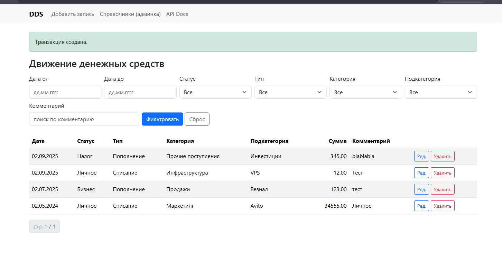
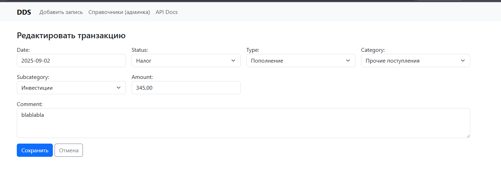
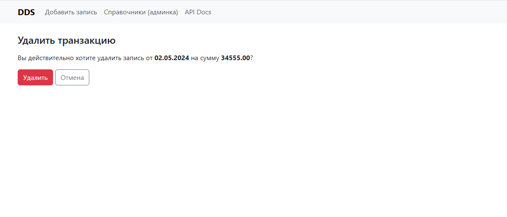
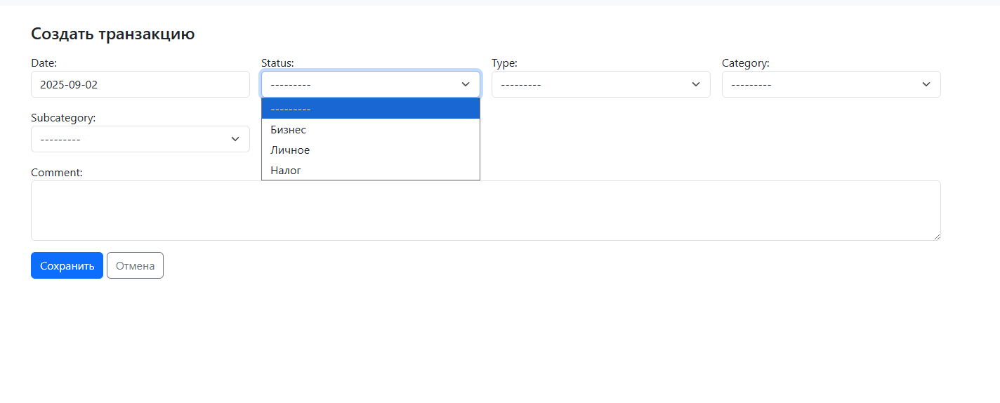
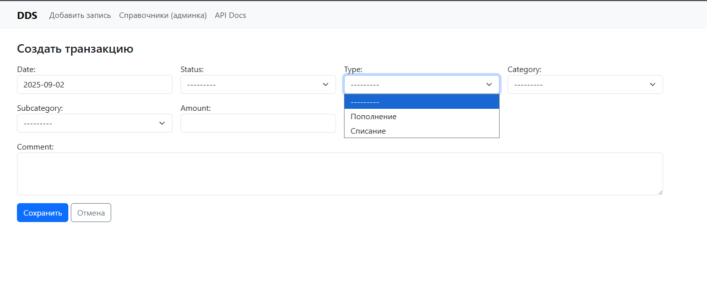
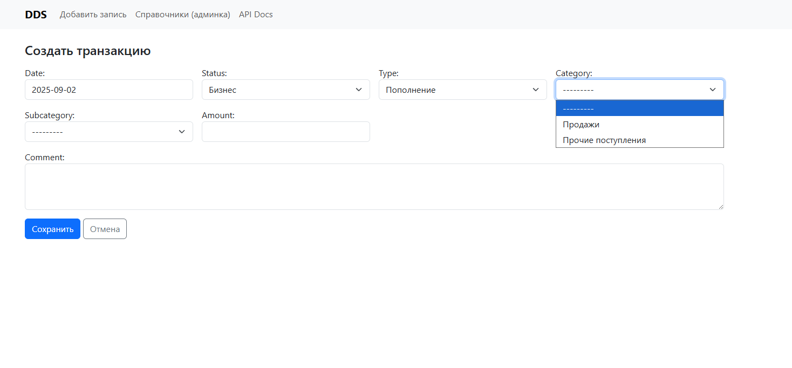
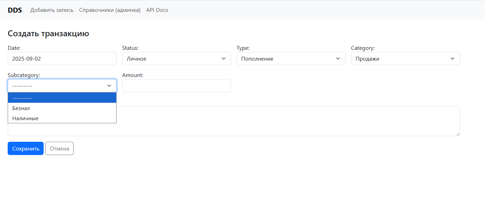
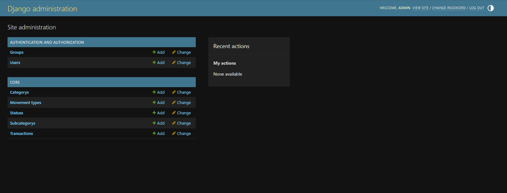
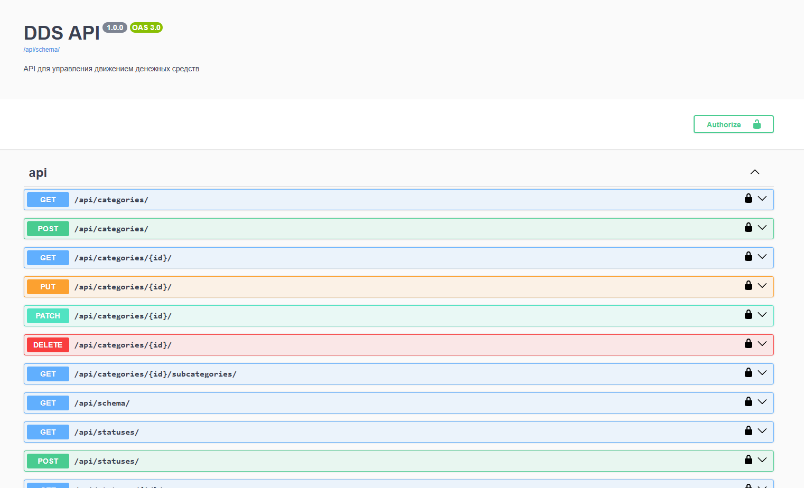
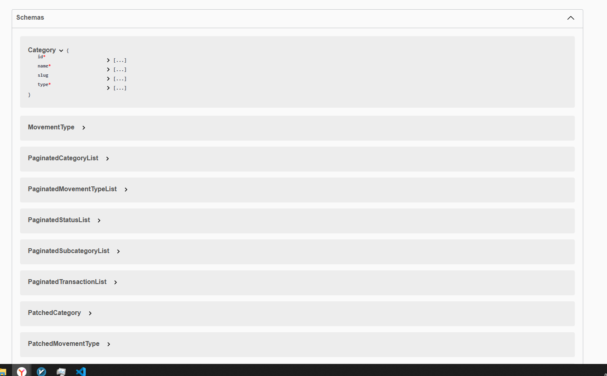

# DDS — Django/DRF

## Установка
```bash
python -m venv .venv
# Windows:
.venv\Scripts\activate
# macOS/Linux:
# source .venv/bin/activate
pip install -r requirements.txt

## Миграции и стартовые данные
python manage.py makemigrations
python manage.py migrate
## Запуск сидера
python manage.py loaddata fixtures/seed.json

## создание админа
python manage.py createsuperuser

## запуск
cd dds_project
python manage.py runserver











